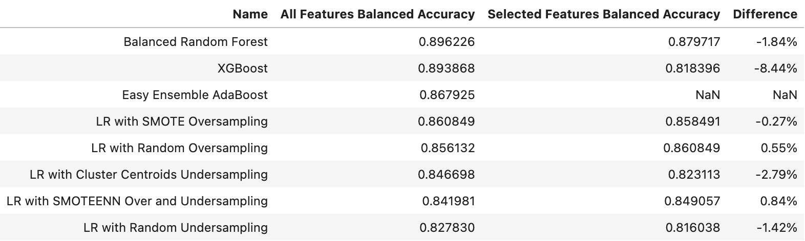
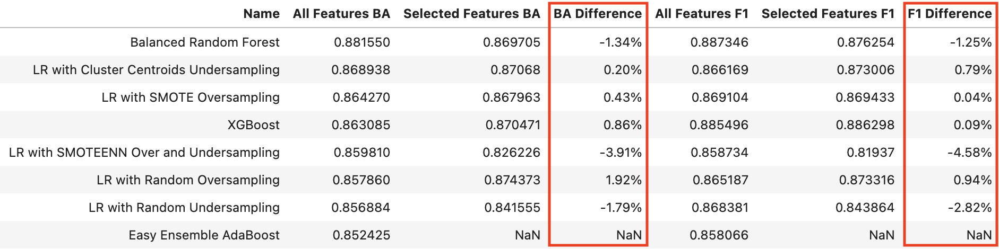
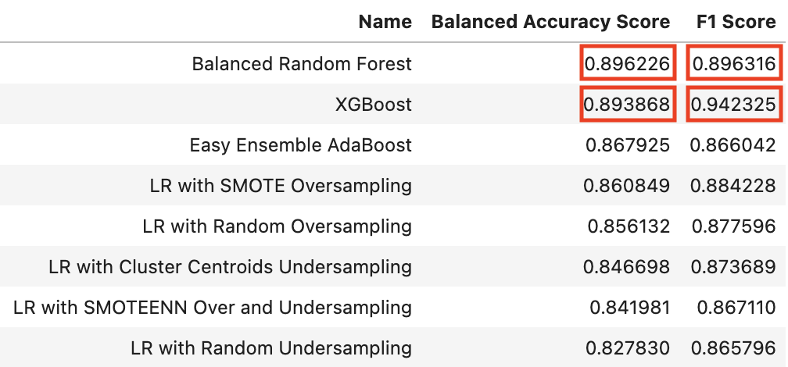
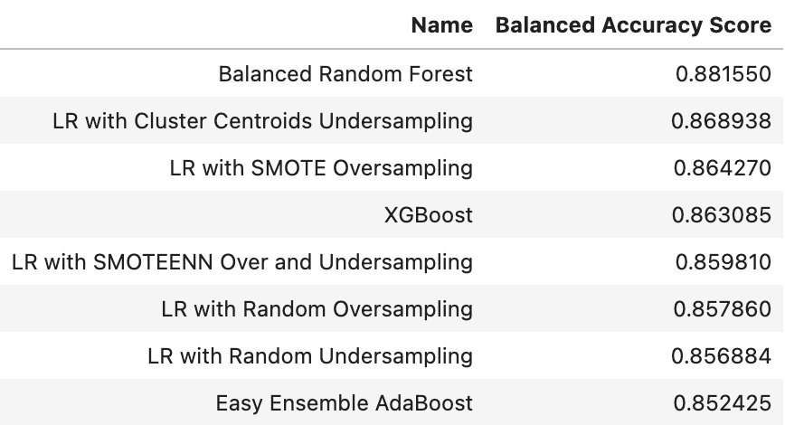
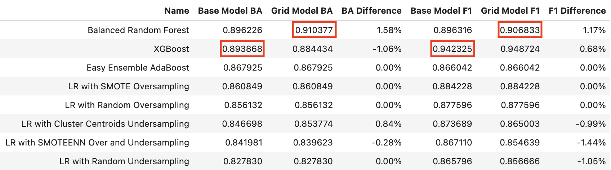
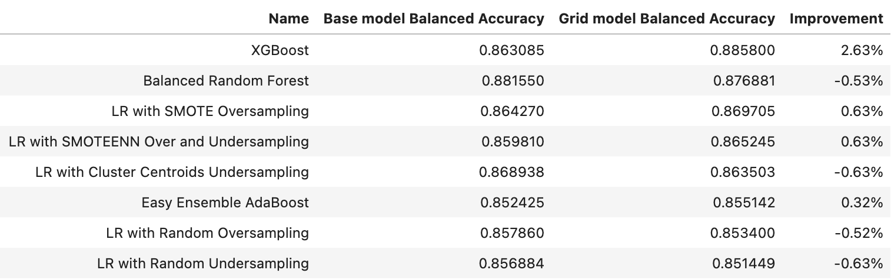
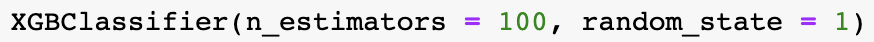
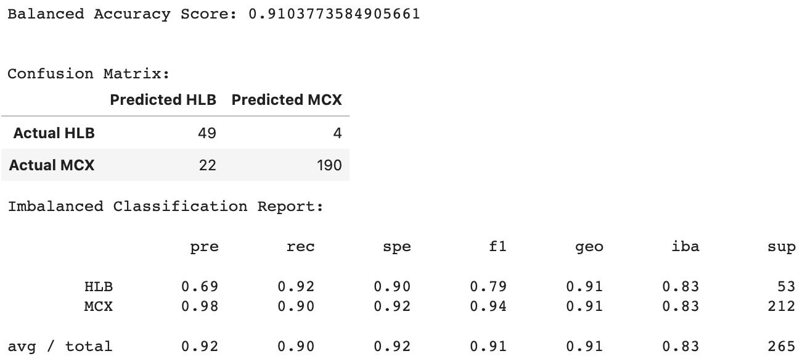
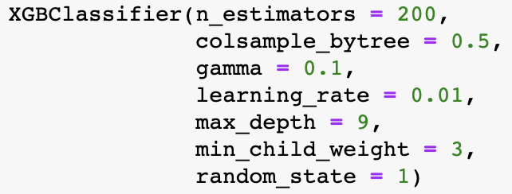
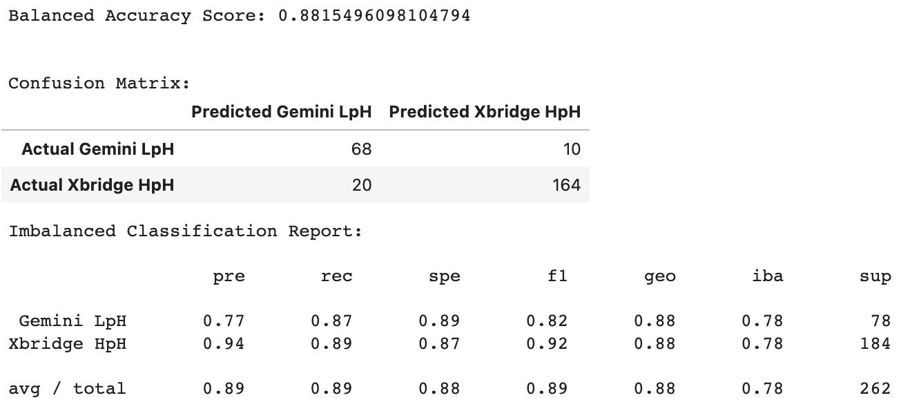

# purifAI: Machine Learning for SPE & LCMS Method Prediction

## Project Overview

### Topic
This project will develop two machine learning models.
1. A model to predict which of two sample preparation and purification methods, also known as solid phase extraction (SPE) methods, is optimal to use for a chemical compound based on properties of that compound's structure. 
2. A model to predict which of two methods for separating and analyzing sample components, also known as liquid chromatography–mass spectrometry (LCMS) methods, is optimal to use for a chemical compound based on properties of that compound's structure.

### Reason for Selection
The team at an automated chemistry platform that works to automate the process of making small chemical compounds to be used in research and development for medicinal purposes is seeking machine learning models that can be used to select the best SPE and LCMS methods to test for purification and analysis of each chemical compound in a large library of compounds. Without machine learning models that can effectively predict the optimal SPE and LCMS methods to use, the team must make a best guess of which methods to test based on a subset of properties of each compound’s structure. This process can be time consuming and expensive, especially if the wrong SPE and/or LCMS method(s) end up being selected and testing must be repeated using other methods. Development of these two machine learning models has the potential to improve the time and cost efficiency of the automated chemistry platform’s process. 

### Data Source
This project utilizes datasets provided by the data team at the automated chemistry platform. The first dataset lists compounds tested by the platform over the past two years and includes compound properties such as molecular weight, topological polar surface area (TPSA), quantitative estimate of drug-likeness (QED), among many others that may be relevant to predicting the appropriate SPE and LCMS methods to use for compound purification and analysis. The second dataset includes the status of testing for each compound and the SPE and LCMS methods used for each compound that has completed the purification stage. Each compound is identified by a unique structure ID, and proprietary information about the actual structure of the compound has been excluded from the datasets.

### Questions to Answer
The questions that will be answered through this project are:
- Which properties of a compound’s structure are relevant to include as features in a machine learning model to predict the optimal SPE method for compound purification?
- Can a machine learning model be developed that has sufficiently high accuracy, precision, and sensitivity for predicting optimal SPE method for compound purification?
- Which machine learning model will perform best for predicting optimal SPE method for compound purification?
- Which properties of a compound’s structure are relevant to include as features in a machine learning model to predict the optimal LCMS method for compound analysis?
- Can a machine learning model be developed that has sufficiently high accuracy, precision, and sensitivity for predicting optimal LCMS method for compound analysis?
- Which machine learning model will perform best for predicting optimal LCMS method for compound analysis?

## Database
A relational database (RDS) was created in Amazon Web Services (AWS), and connected to pgAdmin14. This Postgres database is hosted on the cloud, which can be accessed by anyone with credentials using pgAdmin14. [Data was cleaned by Pandas](https://github.com/jenamis/purifAI/blob/main/database/clean_dataset.ipynb), and stored in AWS S3 bucket. We call the data from RDS by using SQLAlchemy. [Here is the database diagram](https://github.com/jenamis/purifAI/blob/main/database/DBD%20Diagram.png).

## Machine Learning Model
Python scripts with Pandas in Jupyter Notebook were used to test the performance of supervised machine learning (ML) models using the following algorithms and resampling methods:
- Imbalanced-learn's BalancedRandomForestClassifier (Balanced Random Forest)
- Imbalanced-learn's EasyEnsambleClassifier (Easy Ensemble AdaBoost)
- XGBoost's XGBClassifier (XGBoost)
- Scikit-learn's LogisticRegression with the following imbalanced-learn sampling modules:
   - RandomOverSampler (LR with Random Oversampling) 
   - SMOTE (LR with SMOTE Oversampling)
   - RandomUnderSampler (LR with Random Undersampling)
   - ClusterCentroids (LR with Cluster Centroids Undersampling)
   - SMOTEENN (LR with SMOTEENN Over and Undersampling)

One set of models was developed to predict optimal SPE method for compound purification, and a second set was developed to predict optimal LCMS method for compound analysis. All models used compound properties from the "structures" dataset as features (see details below under Feature Engineering & Selection). The listed ML algorithms and sampling methods were selected for testing due to a class imbalance for both binary target variables (SPE method and LCMS method). Model performance was evaluated using the scikit-learn's balanced_accuracy_score and confusion_matrix modules and imbalanced-learn's classification_report_imbalanced module. Model comparisons were based on balanced accuracy score.

### Data Preprocessing
The ML model development scripts connected to the Amazon RDS using SQLAlchemy. An inner join between the "outcomes" and "structures" tables on the "structure_id" column was used to merge the two cleaned datasets. Since the goal of both ML models is to predict optimal methods related to compound purification, only rows where the compound successfully completed the purification stage of testing (indicated by the value "true" in the "spe_successful" column) were retained in the data for model development. For development of the LCMS ML model, the data was further limited to include only rows with one of the main LCMS methods in the "preferred_lcms_method" column (rows with the LunaOmega LpH method were excluded because it is very rarely used).

Data preprocessing continued as outlined below.
- After the merged dataset was loaded into the model development scripts as a pandas DataFrame, all columns from the original "outcomes" dataset **except for** the structure ID ("structure_id") and columns containing the SPE or LCMS method were dropped from the DataFrame. 
   - The dropped columns contained additional outcome data from the compound testing process that may be of interest for future analysis but were extraneous to the current objective of predicting optimal SPE and LCMS methods. 
- Duplicate rows were dropped from the DataFrame. 
   
   **For SPE ML model development:**
   - If a structure ID was tested multiple times with same SPE method, only one row was retained for that structure ID and SPE method combination.
   - If a structure ID was tested successfully with both SPE methods, rows for that structure ID with each SPE method were retained. 
   
   **For LCMS ML model development:**
   - If a structure ID was tested multiple times with same LCMS method, only one row was retained for that structure ID and LCMS method combination.
   - If a structure ID was tested successfully with both LCMS methods, rows for that structure ID with each LCMS method were retained. 
- Scikit-learn's LabelEncoder module was used to transtorm the SPE or LCMS method (target) from string to numerical data. All features were already numerical. **Note:** Since transforming the method to numerical was only necessary for testing the XGBoost model, this preprocessing step was skipped when training the final saved models.

### Feature Engineering & Selection
The original "structures" dataset included 45 compound properties believed to be potentially relevant for predicting the optimal SPE and LCMS methods to use for compound purification and analysis. The base version of each ML model (described under Model Testing & Training) was tested using all 45 properties as features in the model. In addition, all models except Easy Ensamble AdaBoost were tested with a subset of selected features. 
- For the Balanced Random Forest and XGBoost models, feature importances were retrieved and Scikit-learn's SelectFromModel module was used to select the features to include in the subset.
- For the Logistic Regression models, features were sorted in descending order by the absolute value of their coefficient as a proxy for feature importance. For the SPE models, the top 20 features were selected to include in the subset (aligning with the number of selected features for the SPE Balanced Random Forest model). For the LCMS models, the top 14 features were selected to include in the subset (aligning with the number of selected features for the LCMS Balanced Random Forest model). With additional time for model testing and training, a more systematic approach to feature selection for the Logistic Regression models could be undertaken.

The tables below show the balanced accuracy score for the base version of each model with all features included compared with only selected features. Model versions with selected features performed worse or only slightly better than the versions with all features, indicating that the full set of 45 features did not contain extraneous features creating significant "noise" in the model. Additionally, none of the models using only a subset of selected features had a higher balanced accuracy score than the best performing model using all features. Therefore, all features were retained when model testing advanced to the hyperparameter tuning stage.

_**Comparison of Base Model Performance for Predicting SPE Method with All Features and Selected Features**_

_**Comparison of Base Model Performance for Predicting LCMS Method with All Features and Selected Features**_

Since feature values ranged from less than 1 to greater than 700, scikit-learn's StandardScaler module was used to scale all features after completing the train-test split.

### Train-Test Split
The data was split using scikit-learn's train_test_split module with default parameters. The original training and testing sets were used for the Balanced Random Forest, Easy Ensamble AdaBoost, and XGBoost models. Due to the class imbalance for the target variables, each of the Logistic Regression models utilized a resampling method for the training data, as indicated in the name given to the model. 

### Model Testing & Training
Two stages of model testing and training were performed for both SPE model development and LCMS model development. 

#### Initial Testing
Base versions of the ML algorithms and resampling methods listed above were tested and balanced accuracy scores were compared. 
- For Balanced Random Forest, Easy Ensamble AdaBoost, and XGBoost base versions, n_estimators was set equal to 100 and all other hyperparameters were default. 
- For LR base versions, all hyperparameters were default. 

The tables below show a comparison of base model performance sorted from highest to lowest balanced accuracy score. Balanced Random Forest was the best performing model both for predicting SPE method and for predicting LCMS method.

_**Base Model Performance for Predicting SPE Method**_

_**Base Model Performance for Predicting LCMS Method**_

#### Hyperparameter Tuning 
Hyperparameter tuning was performed for all of the ML algorithms listed above.
- For Easy Ensamble AdaBoost, XGBoost, and LR models, scikit-learn's GridSearchCV was used to search for the best hyperparameter values for a small subset of hyperparameters. **SHOULD WE LIST WHICH HYPERPARAMETERS WERE TUNED FOR EACH?** The balanced accuracy score for the model with the best identified hyperparameter values was compared with the balanced accuracy score for the base model.
- Since Balanced Random Forest was the best performing base model, a two-step process for hyperparameter tuning using both scikit-learn's RandomizedSearchCV and GridSearchCV was performed. A random search for best parameters was performed first, followed by a grid search with hyperparameter values set based on the random search results. **SHOULD WE LIST WHICH HYPERPARAMETERS WERE TUNED?** The balanced accuracy score for the model with the best identified hyperparameter values was compared with the balanced accuracy score for the base model.

The tables below show the comparison of base and grid search model performance sorted from highest to lowest balanced accuracy score after hyperparameter tuning. For predicting SPE method, Balanced Random Forest remained the best performing model. For predicting LCMS method, XGBoost had the highest balanced accuracy score after hyperparameter tuning. 

_**Comparison of Base and Grid Search Model Performance for Predicting SPE Method**_

_**Comparison of Base and Grid Search Model Performance for Predicting LCMS Method**_

### Final Model Selection & Performance
Balanced Random Forest was selected as the algorithm for the final ML models for predicting optimal SPE method and optimal LCMS method. Details of each final model and its performance are discussed separately below.

#### SPE ML Model
Although several models had similar best balanced accuracy scores for predicting SPE method, Balance Random Forest was selected for this model due to its slightly higher score. The hyperparameters for the final model are shown below.

Performance metrics for the model are shown and explained below. 
- Balanced Accuracy Score: The model's SPE method predictions for the testing data were correct **91%** of the time. 
- Precision for Predicting MCX: When the method was predicted as MCX, it actually was MCX **98%** of the time.
- Precision for Predicting HLB: When the method was predicted as HLB, it actually was HLB **69%** of the time. This lower precision for predicting HLB was expected due to the substantial class imbalance in the data.
- Recall for Predicting MCX: When the method was actually MCX, the model correctly predicted it as such **90%** of the time.
- Recall for Predicting  HLB: When the method was actually HLB, the model correctly predicted it as such **92%** of the time. 

#### LCMS ML Model
Although XGBoost had a slightly higher best balanced accuracy score than Balanced Random Forest for predicting LCMS method, the difference was negligable and Balanced Random Forest was selected for this model to be consistent with the SPE model. The default hyperparameters used for the base version of the model were used for the final model since performance did not improve through hyperparameter tuning. They are shown below. 

Performance metrics for the model are shown and explained below. 
- Balanced Accuracy Score: The model's LCMS method predictions for the testing data were correct **88%** of the time. 
- Precision for Predicting Xbridge: When the method was predicted as Xbridge, it actually was Xbridge **94%** of the time.
- Precision for Predicting Gemini: When the method was predicted as Gemini, it actually was HLB **77%** of the time. This lower precision for predicting Gemini was expected due to the class imbalance in the data.
- Recall for Predicting Xbridge: When the method was actually Xbridge, the model correctly predicted it as such **89%** of the time.
- Recall for Predicting  Gemini: When the method was actually Gemini, the model correctly predicted it as such **87%** of the time. 

In general, Balanced Random Forest has several benefits that make it a strong choice for these models.
- It is ideal for use with imbalanced classes like SPE method and LCMS method.
- It is not prone to overfitting since it uses a combination of several "weak learner" trees.
- It can run efficiently with large datasets. 

## Team Communication Protocol
The project team will use the following protocol for communicating about the project. 
- A dedicated Slack channel that includes only team members will be used as the primary method for communication about the project.
- Slack messages directed at a specific team member or members will include a mention for the team member(s).
- All team members will have Slack notifications for the channel turned on so they will be alerted to new project messages. 
- All team members will be expected to respond to Slack messages within 24 hours. If no response is received within 24 hours, communication will be re-sent via text message. 
- Brief team meetings will be conducted via Google Meet on Mondays, Wednesdays, and Fridays at 1pm and Tuesdays, Thursdays, and Sundays at 9pm. 
