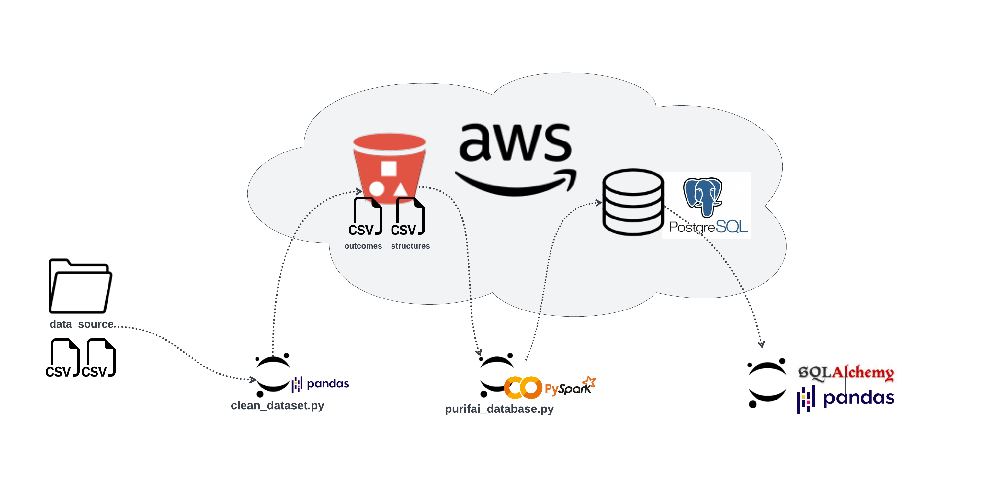
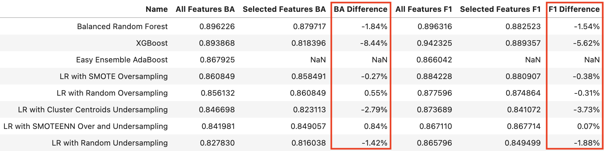

# purifAI: Machine Learning for SPE & LCMS Method Prediction

## Project Overview

### Topic
This project will develop two machine learning models.
1. A model to predict which of two sample preparation and purification methods, also known as solid phase extraction (SPE) methods, is optimal to use for a chemical compound based on properties of that compound's structure. 
2. A model to predict which of two methods for separating and analyzing sample components, also known as liquid chromatography–mass spectrometry (LCMS) methods, is optimal to use for a chemical compound based on properties of that compound's structure.

### Reason for Selection
The team at an automated chemistry platform that works to automate the process of making small chemical compounds to be used in research and development for medicinal purposes is seeking machine learning models that can be used to select the best SPE and LCMS methods to test for purification and analysis of each chemical compound in a large library of compounds. Without machine learning models that can effectively predict the optimal SPE and LCMS methods to use, the team must make a best guess of which methods to test based on a subset of properties of each compound’s structure. This process can be time consuming and expensive, especially if the wrong SPE and/or LCMS method(s) end up being selected and testing must be repeated using other methods. Development of these two machine learning models has the potential to improve the time and cost efficiency of the automated chemistry platform’s process.

### Data Source
This project utilizes datasets provided by the data team at the automated chemistry platform. The first dataset lists compounds tested by the platform over the past two years and includes compound properties such as molecular weight, topological polar surface area (TPSA), quantitative estimate of drug-likeness (QED), among many others that may be relevant to predicting the appropriate SPE and LCMS methods to use for compound purification and analysis. These *molecular descriptors* were generated from input SMILES strings using the python library [RDKit](https://www.rdkit.org/), which provides an extensive [list of available descriptors](https://www.rdkit.org/docs/GettingStartedInPython.html#list-of-available-descriptors). The file for these calculations can be found at [chemCalculate.py](database/chemCalculate.py). 

The second dataset includes the status of testing for each compound and the SPE and LCMS methods used for each compound that has completed the purification stage. Each compound is identified by a unique structure ID, and proprietary information about the actual structure of the compound has been excluded from the datasets.

### Data ETL Process

1. **Raw data was extracted from chemistry platform database as CSV files. These are accessible from AWS S3 buckets:**
   
   - https://purifai.s3.us-west-1.amazonaws.com/data/outcomes.csv
   - https://purifai.s3.us-west-1.amazonaws.com/data/structures.csv
   
2. **Data was transformed and cleaned using pandas in this file [clean_dataset.ipynb](database/clean_dataset.ipynb) and new CSV files were generated. These were uploaded to and are accessible from AWS S3 buckets:**
   
   - https://purifai.s3.us-west-1.amazonaws.com/clean-data/cleaned-outcomes.csv
   - https://purifai.s3.us-west-1.amazonaws.com/clean-data/cleaned-structures.csv
   
     The cleaning of the structures data was straight forward. Due to the structure data’s sensitive and private nature, all that was required was to drop the structure representation fields (SMILES) and encode the `STRUCTURES_ID`s via substring replacements.
   
     The outcomes table cleaning was more cumbersome as the dataset was already in need of thorough cleaning as there was a lot of unmaintained manual data entry from eariler entries of the source data. Namely, the `spe_method` and `lcms_method` fields needed to be accurately null for the model to work properly. This required a manual review and transfer from several other offline data sources. Other transformations were made to the actual data including normalizing all percent or decimal values to be consistent with each field.
   
3. **Data was loaded into the AWS database (*purifai.ceoinb9nwfxg.us-west-1.rds.amazonaws.com*) using PySpark using this file [purifAI_database.ipynb](database/purifAI_database.ipynb).**

[Here is the database diagram](https://github.com/jenamis/purifAI/blob/main/database/DBD%20Diagram.png).

4. **Data for SPE analysis is extracted as a merged table (`spe_analysis_df`) using SQLAlchemy and pandas. This dataframe for analysis is obtained using the code from [spe_analysis_data.ipynb](database/spe_analysis_data.ipynb).**

### Questions to Answer

The questions that will be answered through this project are:
- Which properties of a compound’s structure are relevant to include as features in a machine learning model to predict the optimal SPE method for compound purification?
- Can a machine learning model be developed that has sufficiently high accuracy, precision, and sensitivity for predicting optimal SPE method for compound purification?
- Which machine learning model will perform best for predicting optimal SPE method for compound purification?
- Which properties of a compound’s structure are relevant to include as features in a machine learning model to predict the optimal LCMS method for compound analysis?
- Can a machine learning model be developed that has sufficiently high accuracy, precision, and sensitivity for predicting optimal LCMS method for compound analysis?
- Which machine learning model will perform best for predicting optimal LCMS method for compound analysis?

## Machine Learning Model
Python scripts with Pandas in Jupyter Notebook were used to test the performance of supervised machine learning (ML) models using the following algorithms and resampling methods:
- Imbalanced-learn's `BalancedRandomForestClassifier` (Balanced Random Forest)
- Imbalanced-learn's `EasyEnsembleClassifier` (Easy Ensemble AdaBoost)
- XGBoost's `XGBClassifier` (XGBoost)
- Scikit-learn's `LogisticRegression` with the following imbalanced-learn sampling modules:
   - `RandomOverSampler` (LR with Random Oversampling) 
   - `SMOTE` (LR with SMOTE Oversampling)
   - `RandomUnderSampler` (LR with Random Undersampling)
   - `ClusterCentroids` (LR with Cluster Centroids Undersampling)
   - `SMOTEENN` (LR with SMOTEENN Over and Undersampling)

One set of models was developed to predict optimal SPE method for compound purification, and a second set was developed to predict optimal LCMS method for compound analysis. All models used compound properties from the `structures` dataset as features (see details below under Feature Engineering & Selection). The listed ML algorithms and sampling methods were selected for testing due to a class imbalance for both binary target variables (SPE method and LCMS method). Model performance was evaluated using scikit-learn's `balanced_accuracy_score` and `confusion_matrix` modules and imbalanced-learn's `classification_report_imbalanced` module. Model comparisons were based on balanced accuracy score and weighted F1 score.

### Data Preprocessing
The ML model development scripts connected to the Amazon RDS using SQLAlchemy. An inner join between the `outcomes` and `structures` tables on the `structure_id` column was used to merge the two cleaned datasets. Since the goal of both ML models is to predict optimal methods related to compound purification, only rows where the compound successfully completed the purification stage of testing (indicated by the value "true" in the `spe_successful` column) were retained in the data for model development. For development of the LCMS ML model, the data was further limited to include only rows with one of the main LCMS methods in the `preferred_lcms_method` column (rows with the LunaOmega LpH method were excluded because it is very rarely used).

Data preprocessing continued as outlined below.
- After the merged dataset was loaded into the model development scripts as a pandas DataFrame, all columns from the original `outcomes` dataset **except for** the structure ID (`structure_id`) and columns containing the SPE or LCMS method were dropped from the DataFrame. 
   - The dropped columns contained additional outcome data from the compound testing process that may be of interest for future analysis but were extraneous to the current objective of predicting optimal SPE and LCMS methods. 
- Duplicate rows were dropped from the DataFrame. 
   
   **For SPE ML model development:**
   - If a structure ID was tested multiple times with same SPE method, only one row was retained for that structure ID and SPE method combination.
   - If a structure ID was tested successfully with both SPE methods, rows for that structure ID with each SPE method were retained. 
   
   **For LCMS ML model development:**
   - If a structure ID was tested multiple times with same LCMS method, only one row was retained for that structure ID and LCMS method combination.
   - If a structure ID was tested successfully with both LCMS methods, rows for that structure ID with each LCMS method were retained. 
- Scikit-learn's `LabelEncoder` module was used to transform the SPE or LCMS method (target) from string to numerical data in some of the model testing scripts. All features were already numerical. **Note:** This preprocessing step was skipped when training the final saved models.

### Feature Engineering & Selection
The original `structures` dataset included 45 compound properties believed to be potentially relevant for predicting the optimal SPE and LCMS methods to use for compound purification and analysis. The base version of each ML model (described under Model Testing & Training) was tested using all 45 properties as features in the model. In addition, all models except Easy Ensemble AdaBoost were tested with a subset of selected features. 
- For the Balanced Random Forest and XGBoost models, feature importances were retrieved and Scikit-learn's `SelectFromModel` module was used to select the features to include in the subset.
- For the Logistic Regression models, features were sorted in descending order by the absolute value of their coefficient as a proxy for feature importance. For the SPE models, the top 20 features were selected to include in the subset (aligning with the number of selected features for the SPE Balanced Random Forest model, since the distributions of feature importance were similar). For the LCMS models, the top 14 features were selected to include in the subset (aligning with the number of selected features for the LCMS Balanced Random Forest model). With additional time for model testing and training, a more systematic approach to feature selection for the Logistic Regression models could be undertaken.

The tables below show the balanced accuracy score (abbreviated BA) and F1 score for the base version of each model with all features included compared with only selected features. Model versions with selected features performed worse or only slightly better than the versions with all features, indicating that the full set of 45 features did not contain extraneous features creating significant "noise" in the model. Additionally, none of the models using only a subset of selected features had a higher balanced accuracy score or F1 score than the best performing models using all features. Therefore, all features were retained when model testing advanced to the hyperparameter tuning stage.

***Comparison of Base Model Performance for Predicting SPE Method with All Features and Selected Features***

***Comparison of Base Model Performance for Predicting LCMS Method with All Features and Selected Features***

Since feature values ranged from less than 1 to greater than 700, scikit-learn's `StandardScaler` module was used to scale all features after completing the train-test split.

### Train-Test Split
The data was split using scikit-learn's `train_test_split` module with default parameters. The original training and testing sets were used for the Balanced Random Forest, Easy Ensemble AdaBoost, and XGBoost models. Due to the class imbalance for the target variables, each of the Logistic Regression models utilized a resampling method for the training data, as indicated in the name given to the model. 

### Model Testing & Training
Two stages of model testing and training were performed for both SPE model development and LCMS model development. 

#### Initial Testing
Base versions of the ML algorithms and resampling methods listed above were tested and balanced accuracy scores and F1 scores were compared. 
- For Balanced Random Forest, Easy Ensemble AdaBoost, and XGBoost base versions, n_estimators was set equal to 100 and all other hyperparameters were default. 
- For LR base versions, all hyperparameters were default. 

The tables below show a comparison of base model performance sorted from highest to lowest balanced accuracy score. For the model predicting SPE method, Balanced Random Forest and XGBoost had the highest balanced accuracy and F1 scores. For the model predicting LCMS method, Balanced Random Forest had the highest balanced accuracy and F1 scores, while LR with Cluster Centroids Undersampling and XGBoost had the second highest balanced accuracy score and F1 score, respectively.

***Base Model Performance for Predicting SPE Method***

***Base Model Performance for Predicting LCMS Method***

#### Hyperparameter Tuning 
Hyperparameter tuning was performed for all of the ML algorithms listed above.
- For Balanced Random Forest, a two-step process for hyperparameter tuning using both scikit-learn's `RandomizedSearchCV` and `GridSearchCV` was performed. A random search for best parameters was performed first, followed by a grid search with hyperparameter values set based on the random search results. The following subset hyperparameters were tuned:
   - `n_estimators`
   - `min_samples_split`
   - `min_samples_leaf`
   - `max_features`
   - `max_depth`
   - `bootstrap`
   - `replacement`
- For XGBoost, `GridSearchCV` was used to search for the best values for the following subset of hyperparameters:
   - `n_estimators`
   - `colsample_bytree`
   - `gamma`
   - `learning_rate`
   - `max_depth`
   - `min_child_weight`
- Since the Easy Ensemble AdaBoost and LR base models did not perform as well overall, less attention was given to their hyperparameter tuning and `GridSearchCV` was used to search for the best values for only a small subset of hyperparameters. 
   - For Easy Ensemble AdaBoost: `n_estimators`
   - For LR: `C`, `penalty`

For all models, the balanced accuracy and F1 scores for the version with the best identified hyperparameter values were compared with the scores for the base version. The tables below show these comparisons, and are sorted from highest to lowest balanced accuracy score after hyperparameter tuning. For predicting SPE method, Balanced Random Forest had the highest balanced accuracy score after hyperparameter tuning, but the XGBoost base model still had the highest F1 score. For predicting LCMS method, XGBoost had the highest balanced accuracy score and F1 score after hyperparameter tuning. 

***Comparison of Base and Grid Search Model Performance for Predicting SPE Method***

***Comparison of Base and Grid Search Model Performance for Predicting LCMS Method***

### Final Model Selection & Performance

Balanced Random Forest and XGBoost algorithms both produced high-performing ML models for predicting optimal SPE method and optimal LCMS method. Balanced Random Forest was originally selected for both final models. However, after further comparison of F1 scores and precision and recall values, XGBoost was selected instead for both final models. Details of each final model and its performance are discussed separately below.

#### SPE ML Model
Although Balanced Random Forest had a slightly higher best balanced accuracy score than XGBoost for predicting SPE method , XGBoost was selected for this model due to its higher F1 score. In particular, the precision for predicting HLB (the minority class) was much higher with XGBoost than with Balanced Random Forest. The difference in recall for predicting HLB, where XGBoost performed the worst, was smaller and XGBoost still performed fairly well. Performance metrics for both models are shown below.

***XGBoost Performance Metrics***

 

***Balanced Random Forest Performance Metrics***

Performance metrics for the selected XGBoost model are explained below. 
- Balanced Accuracy Score: The model's SPE method predictions for the testing data were correct **89%** of the time. 
- Precision for Predicting MCX: When the method was predicted as MCX, it actually was MCX **95%** of the time.
- Precision for Predicting HLB: When the method was predicted as HLB, it actually was HLB **90%** of the time. 
- Recall for Predicting MCX: When the method was actually MCX, the model correctly predicted it as such **98%** of the time.
- Recall for Predicting  HLB: When the method was actually HLB, the model correctly predicted it as such **81%** of the time. 

The default hyperparameters used for the base version of the model were used for the final model since performance did not improve through hyperparameter tuning. They are shown below.

#### LCMS ML Model

XGBoost and Balanced Random Forest had nearly equal best balanced accuracy scores for predicting LCMS method, so XGBoost was once again selected for this model due to its higher F1 score. As with the SPE model, XGBoost had a higher precision than Balanced Random Forest for predicting the minority LCMS method class (Gemini). Performance metrics for both models are shown below. 

***XGBoost Performance Metrics***

 

***Balanced Random Forest Performance Metrics***

Performance metrics for the selected XGBoost model are explained below.  
- Balanced Accuracy Score: The model's LCMS method predictions for the testing data were correct **89%** of the time. 
- Precision for Predicting Xbridge: When the method was predicted as Xbridge, it actually was Xbridge **93%** of the time.
- Precision for Predicting Gemini: When the method was predicted as Gemini, it actually was Gemini **88%** of the time. 
- Recall for Predicting Xbridge: When the method was actually Xbridge, the model correctly predicted it as such **95%** of the time.
- Recall for Predicting  Gemini: When the method was actually Gemini, the model correctly predicted it as such **82%** of the time. 

The hyperparameters for the final model are shown below.

In general, XGBoost has several benefits that make it a strong choice for these models.
- It can perform well with imbalanced classes like SPE method and LCMS method.
- It can run efficiently with large datasets. 
- **WHAT ELSE TO ADD?**

## Dashboard

Using HTML/CSS to host a webpage, the team will use a flask template to create a web application that will allow users the ability to input a chemical compound in which the machine learning will predict the best SPE and LCMS method to test for purification and analysis. 

Tableau will also be integrated to create a fully functioning and interactive dashboard that gives the users the ability to compare certain features to SPE and LCMS methods. 

Users will also be able to see which features have the highest importance level. 

The Webpage can be access through [Here](https://teresattrann.github.io/purifAI.github.io/).

## Team Communication Protocol

The project team will use the following protocol for communicating about the project. 
- A dedicated Slack channel that includes only team members will be used as the primary method for communication about the project.
- Slack messages directed at a specific team member or members will include a mention for the team member(s).
- All team members will have Slack notifications for the channel turned on so they will be alerted to new project messages. 
- All team members will be expected to respond to Slack messages within 24 hours. If no response is received within 24 hours, communication will be re-sent via text message. 
- Brief team meetings will be conducted via Google Meet on Mondays, Wednesdays, and Fridays at 1pm and Tuesdays, Thursdays, and Sundays at 9pm. 

## Conclusion

All-in-all, the resulting scores of these trained models seem to encourage an optimistic implementation on real structure predictions. This will hopefully begin to guide automated decisions on purification and analytical method for compounds passing through the robotics platform.

### Positive Outcomes

A highly predictive model implemented in this way would improve the automated chemistry platform by:

- Increasing success quantity metrics; minimize failed sample counts
  - better fitted methods on a per-sample-basis will inherently improve purity and sample recovery results
- Limit the amount of time and resources taken by samples needing to be retrialed through the platform
- Eventually be able to highlight what types of structures are inevitably unsuited for the automated platform, thus indicating to what structures should new methods be developed for
- Open many other doors for similar models ro be applied to other obstacles that challenge the automation of the platform.

### Potential Limitations

Some readily acknowledged limitations of these (or other) models could impact the breadth of their impact:

- The model will only be able to predict accurately for structures that are similar enough to the training set. In the confinements of targeting small molecule drug targets, these are generally all within a certain scope of alikeness
  - As molecules evolve with the growing knowledge of chemistry and drug discovery as time passes, this (or any) model will need to be reoptimized with new and additional data to retain accuracy.
- Only when the predictive model is correcty and consistently indicating successful methods over many different types of samples .

### Expansions & Future Endeavours 

To address the issue of structural likeness between input structures of the model and those that it was trained upon is a relevant, but complex question.

My immediate next development to this tool would be to develop a way of measuring chemico-statistical likeness of a subset against a larger set. This would require analyzing the array of descriptors of each molecule and in a set and extract some sort of statistical relevence against another array of arrays. This would also assume that the selected desctriptors substantially cover those parameters by which structures “differ”.

Additionally, I would expand this predictive work to encompass more fields of data relevent to measuring a given compound’s success throught the platform. I would like do this a implement some deep learning strategies to play with models using a greater coverage of  the relevant data. In the scope of this work, I piqued an interest (without the time to divulge) in deep learning towards the resolution of chemical challenges. I hope to implement prepackaged tools like [deepchem](https://deepchem.io/) and [chainer-chemistry](https://github.com/chainer/chainer-chemistry) to aid those investigations.

Should this project’s work prove successful for predicting purification outcomes by method, I will likely try to expand these goals to the realm of automated synthesis and retrosynthetic AI (at least explorationally).
